# SmartMower

Questo repository contiene i componenti software del progetto SmartMower.

## State Machine — Diagramma (Mermaid)

Il diagramma è generato sulla base della configurazione in `src/config/robot_config.json` (sezione `mqtt.topics.state_machine`).

```mermaid
stateDiagram-v2
    [*] --> STATE_INIT

    STATE_INIT --> STATE_IDLE: EVENT_INIT_COMPLETE
    STATE_INIT --> STATE_EMERGENCY_STOP: EVENT_EMERGENCY_STOP
    STATE_INIT --> STATE_ERROR: EVENT_TIMEOUT
    STATE_INIT --> STATE_ERROR: EVENT_ERROR_OCCURRED

    STATE_IDLE --> STATE_UNDOCKING: EVENT_START_MOWING
    STATE_IDLE --> STATE_MANUAL_CONTROL: EVENT_MANUAL_CONTROL
    STATE_IDLE --> STATE_EMERGENCY_STOP: EVENT_EMERGENCY_STOP
    STATE_IDLE --> STATE_ERROR: EVENT_ERROR_OCCURRED
    STATE_IDLE --> STATE_DOCKING: EVENT_BATTERY_LOW

    STATE_UNDOCKING --> STATE_MOWING: EVENT_UNDOCKING_COMPLETE
    STATE_UNDOCKING --> STATE_EMERGENCY_STOP: EVENT_EMERGENCY_STOP
    STATE_UNDOCKING --> STATE_PAUSED: EVENT_PAUSE
    STATE_UNDOCKING --> STATE_ERROR: EVENT_TIMEOUT
    STATE_UNDOCKING --> STATE_ERROR: EVENT_ERROR_OCCURRED
    STATE_UNDOCKING --> STATE_PAUSED: EVENT_OBSTACLE_DETECTED
    STATE_UNDOCKING --> STATE_PAUSED: EVENT_PERIMETER_CROSSED

    STATE_MOWING --> STATE_PAUSED: EVENT_PAUSE
    STATE_MOWING --> STATE_EMERGENCY_STOP: EVENT_EMERGENCY_STOP
    STATE_MOWING --> STATE_DOCKING: EVENT_BATTERY_LOW
    STATE_MOWING --> STATE_PAUSED: EVENT_OBSTACLE_DETECTED
    STATE_MOWING --> STATE_PAUSED: EVENT_PERIMETER_CROSSED
    STATE_MOWING --> STATE_DOCKING: EVENT_AREA_COMPLETE
    STATE_MOWING --> STATE_ERROR: EVENT_ERROR_OCCURRED

    STATE_DOCKING --> STATE_CHARGING: EVENT_DOCKING_COMPLETE
    STATE_DOCKING --> STATE_EMERGENCY_STOP: EVENT_EMERGENCY_STOP
    STATE_DOCKING --> STATE_ERROR: EVENT_TIMEOUT
    STATE_DOCKING --> STATE_ERROR: EVENT_ERROR_OCCURRED
    STATE_DOCKING --> STATE_PAUSED: EVENT_OBSTACLE_DETECTED

    STATE_CHARGING --> STATE_IDLE: EVENT_BATTERY_FULL
    STATE_CHARGING --> STATE_UNDOCKING: EVENT_START_MOWING
    STATE_CHARGING --> STATE_MANUAL_CONTROL: EVENT_MANUAL_CONTROL
    STATE_CHARGING --> STATE_EMERGENCY_STOP: EVENT_EMERGENCY_STOP
    STATE_CHARGING --> STATE_ERROR: EVENT_ERROR_OCCURRED

    STATE_MANUAL_CONTROL --> STATE_PAUSED: EVENT_PAUSE
    STATE_MANUAL_CONTROL --> STATE_IDLE: EVENT_RESUME
    STATE_MANUAL_CONTROL --> STATE_EMERGENCY_STOP: EVENT_EMERGENCY_STOP
    STATE_MANUAL_CONTROL --> STATE_ERROR: EVENT_ERROR_OCCURRED

    STATE_PAUSED --> STATE_MOWING: EVENT_RESUME
    STATE_PAUSED --> STATE_EMERGENCY_STOP: EVENT_EMERGENCY_STOP
    STATE_PAUSED --> STATE_ERROR: EVENT_ERROR_OCCURRED
    STATE_PAUSED --> STATE_DOCKING: EVENT_BATTERY_LOW

    STATE_EMERGENCY_STOP --> STATE_IDLE: EVENT_EMERGENCY_RECOVER
    STATE_EMERGENCY_STOP --> STATE_ERROR: EVENT_ERROR_OCCURRED

    STATE_ERROR --> STATE_IDLE: EVENT_EMERGENCY_RECOVER
    STATE_ERROR --> STATE_MANUAL_CONTROL: EVENT_MANUAL_CONTROL
```

Nota: il diagramma è un artefatto di documentazione. La logica di guardie/azioni vive nel codice dei nodi C/C++.

## Documentazione
- Config: `src/config/robot_config.json`
- TODO: `docs/PROJECT_TODO.md`
- Web admin: `web/README.md`
- Firmware: `firmware/README.md`
- Tests: `tests/README.md`
