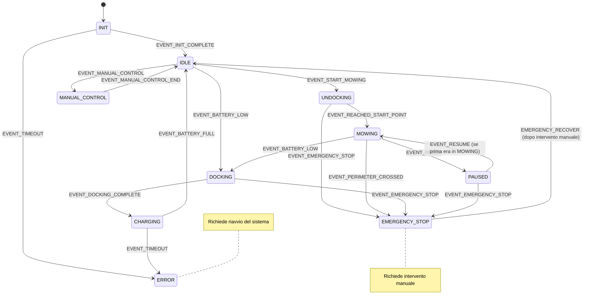

# Smart Mower State Machine

Questo modulo implementa la macchina a stati principale per il controllo del robot tagliaerba intelligente.

## Architettura

La macchina a stati è implementata in C e gestisce tutti i modi operativi del robot:

### Stati Implementati

1. **INIT** - Inizializzazione del sistema
2. **IDLE** - Attesa di comandi
3. **MOWING** - Taglio dell'erba
4. **CHARGING** - Ricarica della batteria
5. **EMERGENCY_STOP** - Arresto di emergenza

### Stati da Completare

- **UNDOCKING** - Uscita dalla base di ricarica
- **DOCKING** - Ritorno alla base di ricarica
- **MANUAL_CONTROL** - Controllo manuale
- **ERROR** - Gestione errori
- **PAUSED** - Pausa temporanea

## Struttura dei File

```
src/state_machine/
├── include/
│   ├── state_machine.h          # Header principale
│   └── states/
│       ├── base_state.h         # Stato base
│       ├── init_state.h         # Stato di inizializzazione
│       ├── idle_state.h         # Stato di attesa
│       ├── mowing_state.h       # Stato di taglio
│       ├── charging_state.h     # Stato di ricarica
│       └── emergency_stop_state.h # Stato di emergenza
├── src/
│   ├── state_machine.c          # Implementazione principale
│   ├── state_machine_main.c     # Applicazione principale
│   └── states/
│       ├── base_state.c         # Funzioni base comuni
│       ├── init_state.c         # Implementazione inizializzazione
│       ├── idle_state.c         # Implementazione attesa
│       ├── mowing_state.c       # Implementazione taglio
│       ├── charging_state.c     # Implementazione ricarica
│       └── emergency_stop_state.c # Implementazione emergenza
├── systemd/
│   └── state_machine.service    # File di servizio systemd
├── config.json                  # Configurazione
├── Makefile                     # Build system
└── README.md                    # Questa documentazione
```

## Compilazione

```bash
# Compilazione standard
make

# Compilazione con debug
make debug

# Pulizia
make clean

# Test di compilazione
make test
```

## Installazione

```bash
# Installa nel sistema
sudo make install

# Rimuove dal sistema
sudo make uninstall
```

## Configurazione

Il file `config.json` contiene tutte le configurazioni:

- **MQTT**: Connessione al broker MQTT
- **Robot**: Parametri del robot (batteria, area, navigazione)
- **Stati**: Configurazione specifica per ogni stato
- **Logging**: Configurazione dei log
- **Debug**: Opzioni di debug e test

## Utilizzo

### Avvio Manuale

```bash
# Avvio diretto
./state_machine

# Con configurazione personalizzata
./state_machine -c /path/to/config.json
```

### Avvio come Servizio

```bash
# Abilita e avvia il servizio
sudo systemctl enable state_machine.service
sudo systemctl start state_machine.service

# Stato del servizio
sudo systemctl status state_machine.service

# Log del servizio
sudo journalctl -u state_machine.service -f
```

## Integrazione MQTT

### Topic Sottoscritti

- `smartmower/state/fusion` - Dati dal fusion sensor
- `smartmower/sensors/+` - Tutti i sensori
- `smartmower/commands/state_machine` - Comandi per la macchina a stati

### Topic Pubblicati

- `smartmower/state/machine` - Stato corrente della macchina
- `smartmower/commands/robot` - Comandi per il robot
- `smartmower/debug/state_machine` - Informazioni di debug

### Comandi MQTT

Invia comandi via MQTT al topic `smartmower/commands/state_machine`:

```bash
# Avvia il taglio
mosquitto_pub -t "smartmower/commands/state_machine" -m "start_mowing"

# Arresto di emergenza
mosquitto_pub -t "smartmower/commands/state_machine" -m "emergency_stop"

# Pausa
mosquitto_pub -t "smartmower/commands/state_machine" -m "pause"

# Riprendi
mosquitto_pub -t "smartmower/commands/state_machine" -m "resume"
```

## Gestione Aree Grandi (6000 mq)

Il sistema è progettato per gestire aree di 6000 mq con le seguenti caratteristiche:

1. **Ricarica Automatica**: Quando la batteria scende sotto il 20%, il robot torna automaticamente alla base
2. **Ripresa Missione**: Dopo la ricarica (80%), il robot riprende il taglio dal punto in cui si era interrotto
3. **Pattern di Taglio**: Utilizza un pattern a spirale per massimizzare l'efficienza
4. **Monitoraggio Progresso**: Tiene traccia dell'area coperta e del progresso

## Log e Debug

### File di Log

- `/opt/smartmower/log/state_machine.log` - Log principale
- `journalctl -u state_machine.service` - Log di sistema

### Livelli di Log

- **CRITICAL**: Emergenze e errori critici
- **ERROR**: Errori
- **WARNING**: Avvertimenti
- **INFO**: Informazioni generali
- **DEBUG**: Informazioni di debug

## Dipendenze

### Librerie Richieste

- `libmosquitto-dev` - Client MQTT
- `libjson-c-dev` - Parsing JSON
- `build-essential` - Compilatore C

### Servizi Richiesti

- `mosquitto` - Broker MQTT
- `fusion_sensor` - Sensore di fusione GPS/IMU

## Sicurezza

### Arresto di Emergenza

Il sistema implementa un arresto di emergenza che:

1. Ferma immediatamente tutti i motori
2. Mantiene il robot in stato sicuro
3. Richiede intervento manuale per la ripresa
4. Log di tutti gli eventi di emergenza

### Gestione Errori

- Timeout per ogni stato critico
- Recupero automatico quando possibile
- Fallback a stati sicuri in caso di errore

## Estensibilità

Per aggiungere nuovi stati:

1. Crea i file header e implementazione in `include/states/` e `src/states/`
2. Aggiungi la funzione `get_nuovo_stato()` 
3. Aggiorna il Makefile con i nuovi file
4. Implementa le transizioni negli stati esistenti

## Troubleshooting

### Problemi Comuni

1. **Connessione MQTT fallita**: Verifica che mosquitto sia in esecuzione
2. **Timeout inizializzazione**: Controlla i sensori e le dipendenze
3. **Stati bloccati**: Controlla i log per errori specifici

### Debug

Abilita il debug nel file di configurazione e monitora i log per informazioni dettagliate.

## Macchina a Stati

### Diagramma dello Stato



### Tabella delle Transizioni di Stato

| Stato | Come si entra | Come si esce |
|-------|---------------|--------------|
| **INIT** | All'avvio del sistema | Dopo `EVENT_INIT_COMPLETE` o `EVENT_TIMEOUT` |
| **IDLE** | Dopo inizializzazione o completamento operazioni | - `EVENT_START_MOWING` → UNDOCKING<br>- `EVENT_BATTERY_LOW` → DOCKING<br>- `EVENT_MANUAL_CONTROL` → MANUAL_CONTROL |
| **UNDOCKING** | Da IDLE con `EVENT_START_MOWING` | - `EVENT_REACHED_START_POINT` → MOWING<br>- `EVENT_EMERGENCY_STOP` → EMERGENCY_STOP |
| **MOWING** | Da UNDOCKING con `EVENT_REACHED_START_POINT` | - `EVENT_BATTERY_LOW` → DOCKING<br>- `EVENT_OBSTACLE_DETECTED` → PAUSED<br>- `EVENT_PAUSE` → PAUSED<br>- `EVENT_PERIMETER_CROSSED` → EMERGENCY_STOP |
| **DOCKING** | Da MOWING con `EVENT_BATTERY_LOW` o `EVENT_MISSION_COMPLETE` | - `EVENT_DOCKING_COMPLETE` → CHARGING<br>- `EVENT_EMERGENCY_STOP` → EMERGENCY_STOP |
| **CHARGING** | Da DOCKING con `EVENT_DOCKING_COMPLETE` | - `EVENT_BATTERY_FULL` → IDLE<br>- `EVENT_TIMEOUT` → ERROR<br>- `EVENT_PAUSE` → PAUSED |
| **PAUSED** | Da MOWING/CHARGING con `EVENT_PAUSE` | - `EVENT_RESUME` → Stato precedente<br>- `EVENT_EMERGENCY_STOP` → EMERGENCY_STOP |
| **EMERGENCY_STOP** | Da qualsiasi stato con `EVENT_EMERGENCY_STOP` | Solo con `EVENT_RESUME` (richiede intervento manuale) |
| **MANUAL_CONTROL** | Da IDLE con `EVENT_MANUAL_CONTROL` | - Ritorno automatico a IDLE quando rilasciato |
| **ERROR** | Da qualsiasi stato con `EVENT_ERROR_OCCURRED` | Richiede riavvio manuale |

### Transizioni Speciali

Alcune transizioni possono verificarsi da qualsiasi stato:
- **EMERGENCY_STOP**: Attivato da `EVENT_EMERGENCY_STOP`
  - Ferma immediatamente tutti i motori
  - Richiede intervento manuale per il ripristino
  - Può essere attivato da:
    - Pulsante di emergenza fisico
    - Rilevamento di condizioni critiche
    - Comando remoto di emergenza

- **ERROR**: Attivato da `EVENT_ERROR_OCCURRED`
  - Si verifica in caso di errori irreversibili
  - Richiede riavvio del sistema
  - Registra il codice di errore per il debug

### Best Practices

1. **Gestione degli Errori**:
   - Ogni stato dovrebbe gestire i propri errori specifici
   - Usare `EVENT_ERROR_OCCURRED` per errori non gestibili
   - Registrare sempre i messaggi di errore con dettagli utili

2. **Transizioni di Stato**:
   - Utilizzare sempre `state_machine_transition()` per cambiare stato
   - Verificare le precondizioni prima di ogni transizione
   - Implementare sempre i callback `on_enter` e `on_exit`

3. **Sicurezza**:
   - Lo stato EMERGENCY_STOP ha la massima priorità
   - Tutti i comandi di movimento devono essere verificati per la sicurezza
   - Mantenere aggiornato lo stato della batteria

4. **Debug**:
   - Abilitare i log dettagliati per le transizioni di stato
   - Monitorare il topic MQTT `smartmower/state/machine`
   - Implementare comandi di test per ogni stato

### Esempi di Flusso

**Avvio del Taglio:**
1. `INIT` → `IDLE` (completamento inizializzazione)
2. `IDLE` → `UNDOCKING` (comando di avvio)
3. `UNDOCKING` → `MOWING` (raggiunto punto di inizio)

**Ricarica Automatica:**
1. `MOWING` → `DOCKING` (batteria bassa)
2. `DOCKING` → `CHARGING` (aggancio completato)
3. `CHARGING` → `IDLE` (batteria carica)

**Emergenza:**
1. Qualsiasi stato → `EMERGENCY_STOP` (pulsante premuto)
2. `EMERGENCY_STOP` → `IDLE` (dopo intervento manuale)
